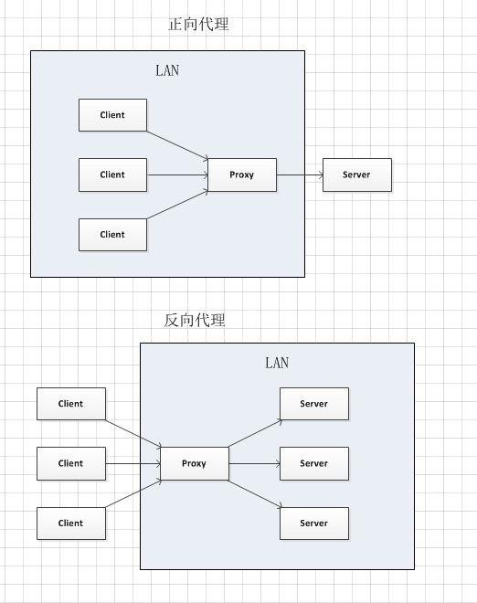

# Proxy

## 正向代理

正向代理通过上面的图理解其实就是用户想从服务器拿资源数据，但是只能通过proxy服务器才能拿到，所以用户A只能去访问proxy服务器然后通过proxy服务器去服务器B拿数据，这种情况用户是明确知道你要访问的是谁，在我们生活中最典型的案例就是“翻墙“了，也是通过访问代理服务器最后访问外网的。

## 反向代理

反向代理其实就是客户端去访问服务器时，他并不知道会访问哪一台，感觉就是客户端访问了Proxy一样，而实则就是当proxy关口拿到用户请求的时候会转发到代理服务器中的随机（算法）某一台。而在用户看来，他只是访问了Proxy服务器而已，典型的例子就是负载均衡了。

## 参考

- [正向代理和反向代理的区别](http://baijiahao.baidu.com/s?id=1600687025749463237&wfr=spider&for=pc)
